# Лабораторная работа №2: Однослойный перцептрон

**Работу выполнил:** студент 1 курса, группа 14, Малахов Г. В.  
**Репозиторий GitHub:** [https://github.com/ggmaster913/lab2_linal](https://github.com/ggmaster913/lab2_linal)

---

## 1. Цель работы
Самостоятельно реализовать алгоритм обучения однослойного перцептрона с нуля на языке Python без использования готовых библиотек глубокого обучения (PyTorch, TensorFlow). Провести экспериментальный анализ влияния гиперпараметров (learning rate, batch size, инициализация весов) на процесс обучения. Дополнительно реализовать собственный генератор данных, L2-регуляризацию, функцию потерь Hinge loss и метод градиентного спуска с моментом (Momentum).

---

## 2. Теоретические сведения

### Математическая модель
Перцептрон вычисляет взвешенную сумму входов и пропускает результат через сигмоидную функцию активации:
$$z=w^Tx+b=\sum_{i=1}^dw_ix_i+b$$
$$\hat{y}=\sigma(z)=\frac{1}{1+e^{-z}}$$

Где $x\in\mathbb{R}^d$ — вектор признаков, $w\in\mathbb{R}^d$ — вектор весов, $b$ — смещение (bias).

### Функция потерь и градиенты
Для бинарной классификации используется логистическая функция потерь (Binary Cross-Entropy) по мини-батчу размера $m$:
$$L=-\frac{1}{m}\sum_{i=1}^m[y_i\log\hat{y}_i+(1-y_i)\log(1-\hat{y}_i)]$$

Обновление параметров происходит методом градиентного спуска:
$$w\leftarrow w-\eta\frac{\partial L}{\partial w}, \quad b\leftarrow b-\eta\frac{\partial L}{\partial b}$$

Градиенты рассчитываются по формулам:
$$\frac{\partial L}{\partial w}=\frac{1}{m}X^T(\hat{y}-y), \quad \frac{\partial L}{\partial b}=\frac{1}{m}\sum_{i=1}^m(\hat{y}_i-y_i)$$

---

## 3. Базовый эксперимент
Модель была обучена на линейно разделимых синтетических данных со следующими гиперпараметрами: $\eta = 0.1$, количество эпох = 100, размер батча = 32. 
Перед обучением данные прошли Z-стандартизацию ($x'=\frac{x-\mu}{\sigma}$) и стратифицированное разбиение (70% train / 30% test).

**Метрики качества финальной модели:**
* **Accuracy:** 0.8800
* **Precision:** 0.8640
* **Recall:** 0.8920
* **F1-score:** 0.8778

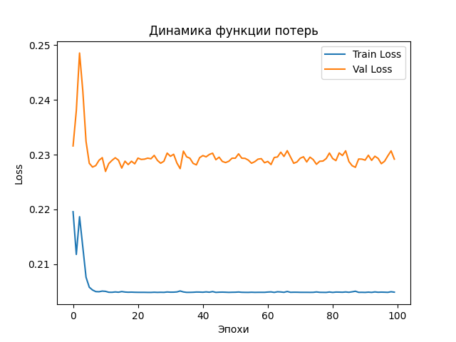
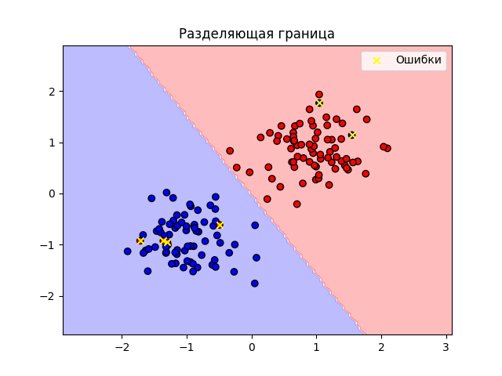

*Анализ:* График функции потерь демонстрирует плавную и стабильную сходимость. Разделяющая гиперплоскость корректно разделяет два гауссовых облака, допуская ошибки только на искусственно зашумленных данных в зоне пересечения классов.

---

## 4. Эксперименты и анализ (согласно ТЗ)

### 4.1. Влияние скорости обучения (Learning Rate)
Были протестированы значения $\eta \in \{0.001, 0.5, 1.0\}$.

* **$\eta = 0.001$**: Обучение происходит экстремально медленно. Градиентные шаги слишком малы, за 100 эпох модель не успевает сойтись к минимуму.
  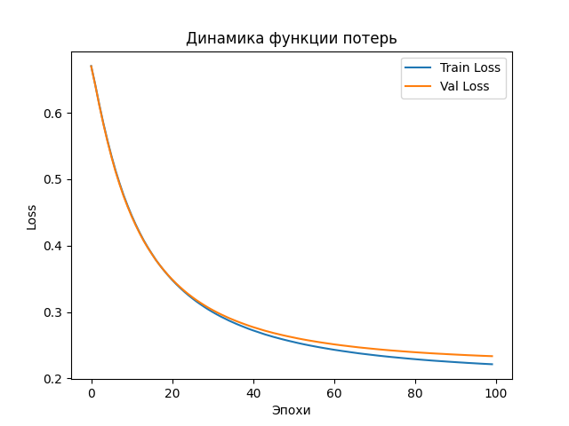

* **$\eta = 0.5$ и $\eta = 1.0$**: Наблюдаются сильные осцилляции (колебания). Из-за слишком большого шага модель регулярно "перепрыгивает" локальный минимум, что дестабилизирует процесс обучения.
  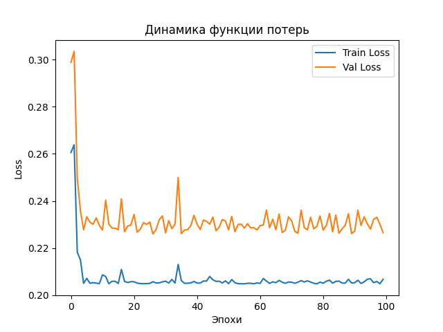
  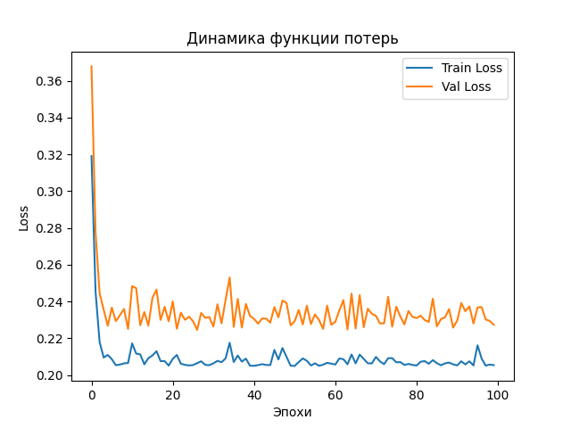

### 4.2. Влияние размера батча (Batch Size)
Исследовались размеры 1 и 256.

* **Batch Size = 1 (Stochastic Gradient Descent)**: График потерь обладает высокой дисперсией (шумом), так как веса обновляются на основе одного примера.
  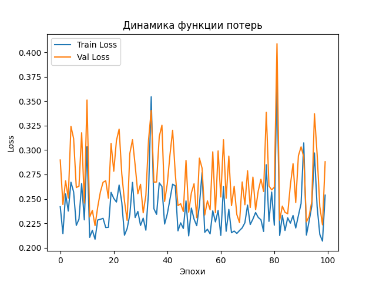

* **Batch Size = 256**: График потерь максимально сглаженный, однако сходимость замедляется, так как за одну эпоху происходит мало обновлений весов.
  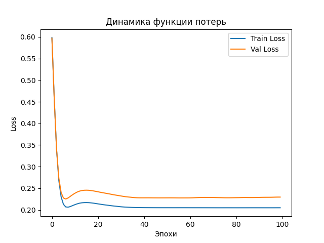

### 4.3. Влияние инициализации весов
* **Нулевая ($w=0$)**: Допустима для однослойного перцептрона, но замедляет выход на оптимальную траекторию.
* **Маленькие случайные (по умолчанию)**: Оптимальный вариант, обеспечивает быстрый старт без насыщения градиентов.
* **Большие значения $\mathcal{N}(0, 10)$**: Значения $z$ сразу становятся слишком большими по модулю, сигмоида уходит в зону насыщения (выдает строго 0 или 1), из-за чего градиент $\sigma'(z) = \sigma(z)(1-\sigma(z))$ зануляется. Модель практически перестает обучаться (эффект "паралича сети").

---

## 5. Дополнительные задания (Бонусы)

### 5.1. Собственный генератор и нелинейные данные
Был реализован генератор, создающий данные типа **XOR** и **Окружность (Circle)**. 
На нелинейных данных перцептрон полностью терпит неудачу (Accuracy падает до ~50%), так как уравнение $w^Tx+b=0$ физически способно задать только прямую линию (гиперплоскость).

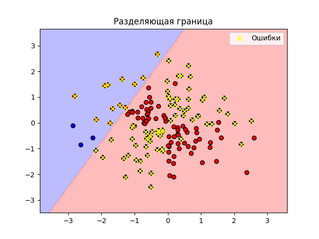
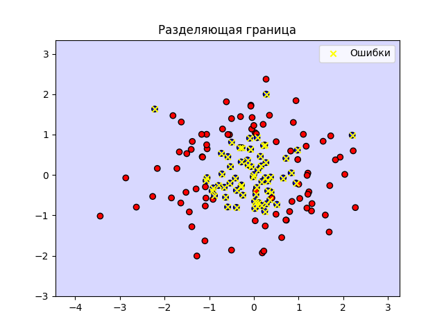

### 5.2. Исследование сходимости с Momentum
Обычный SGD ($\beta = 0.0$) склонен к зигзагообразным движениям. Внедрение импульса ($\beta = 0.9$) позволило накапливать экспоненциально взвешенную сумму прошлых градиентов, что сгладило сходимость и ускорило её на первых этапах. Однако при $\beta = 0.99$ импульс накапливает избыточную "инерцию", что приводит к сильным перелетам через оптимум.

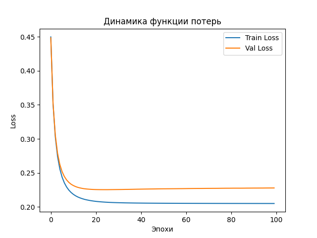
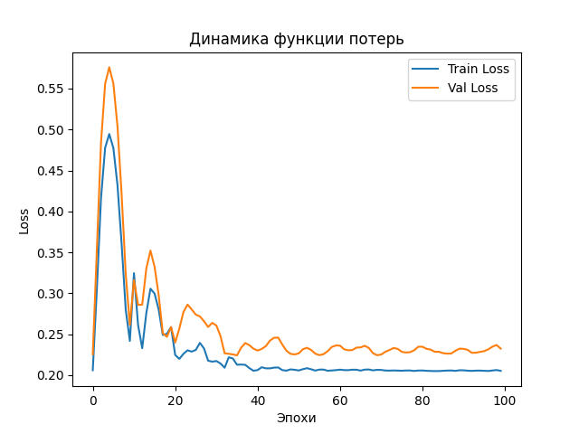

### 5.3. Регуляризация L2 и Hinge Loss
* Добавление штрафа L2 ограничило норму вектора весов $\|w\|^2$, предотвращая переобучение на выбросах.
* Альтернативная функция потерь Hinge Loss $L = \max(0, 1 - yz)$ (где $y\in\{-1, 1\}$) успешно справилась с классификацией, направляя модель на максимизацию зазора (margin) между классами аналогично SVM.

---

## 6. Заключение
В ходе выполнения лабораторной работы подтверждено, что однослойный перцептрон эффективно решает задачу бинарной классификации линейно разделимых данных. Практическим путем доказано, что критически важным этапом является корректный подбор скорости обучения ($\eta \approx 0.1$) и размера батча (32-64), а также использование малых случайных весов при инициализации во избежание затухания градиента. Нелинейные задачи (XOR) требуют внедрения скрытых слоев и перехода к архитектуре многослойного перцептрона (MLP).
